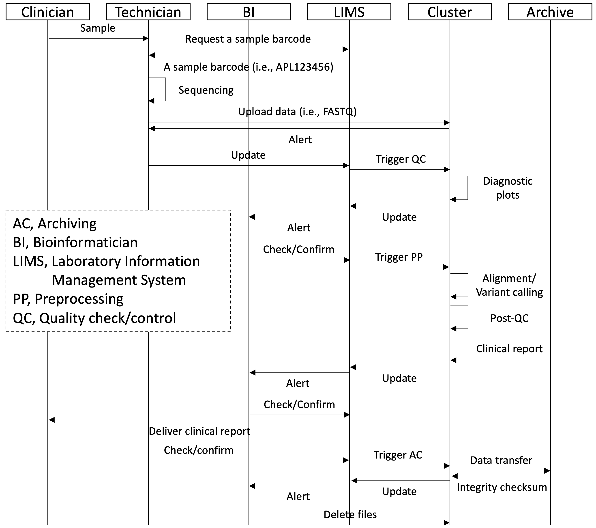

# APL-LIMS
### About
 * APL-LIMS (Laboratory Information Management Sysmtem) is a software that allows clinicians, scientists, and technicians to effectively manage laboratory data in real-time and to make sure all tasks are completed in a successful and timely manner. 

### Features
 * Run an automated pipeline to reduce human error
 * Avoid missed sampling events/Check the statues in read-time
 * Prevent expired analytical holding times

### Workflow
 * Sequence diagram // 

